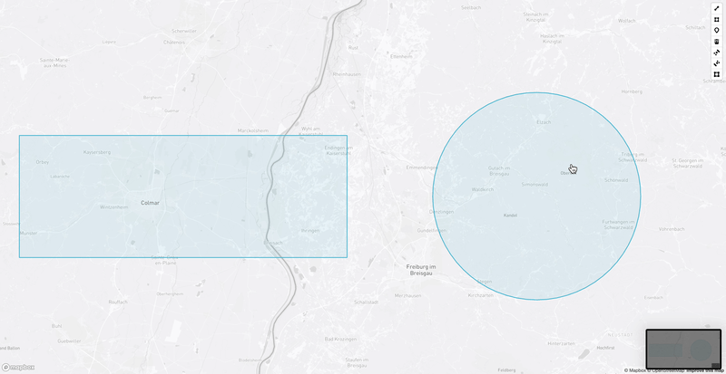

[](https://www.npmjs.com/package/mapbox-gl-draw-split-polygon-mode)


# mapbox-gl-draw-split-polygon-mode

A custom mode for [MapboxGL-Draw](https://github.com/mapbox/mapbox-gl-draw) to split polygons based on a drawn lineString.

> Check [mapbox-gl-draw-split-line-mode](https://github.com/ReyhaneMasumi/mapbox-gl-draw-split-line-mode) For splitting lineStrings.

## [DEMO](https://reyhanemasumi.github.io/mapbox-gl-draw-split-polygon-mode/)



## Install

```bash
npm install mapbox-gl-draw-split-polygon-mode
```

or use CDN:

```html
<script src="https://unpkg.com/mapbox-gl-draw-split-polygon-mode"></script>
```

## Usage

```js
import mapboxGl from "mapbox-gl";
import MapboxDraw from "@mapbox/mapbox-gl-draw";
import defaultDrawStyle from "@mapbox/mapbox-gl-draw/src/lib/theme.js";

import SplitPolygonMode, {
  drawStyles as splitPolygonDrawStyles,
} from "mapbox-gl-draw-split-polygon-mode";

const map = new mapboxgl.Map({
  container: "map",
  center: [-91.874, 42.76],
  zoom: 12,
});

draw = new MapboxDraw({
  userProperties: true,
  displayControlsDefault: false,
  modes: {
    ...SplitPolygonMode(MapboxDraw.modes),
  },
  styles: [...splitPolygonDrawStyles(defaultDrawStyle)],
  userProperties: true,
});

map.addControl(draw);

/// Activate the mode
draw.changeMode("split_polygon");

/// you can modify the behavior using these options:
draw.changeMode(
  "split_polygon",
  /** Default option values: */
  {
    highlightColor: "#222",
    lineWidth: 0,
    lineWidthUnit: "kilometers",
  }
);
```

> The syntax used here is because `mapbox-gl-draw-split-polygon-mode` needs to modify the modes object and also the `styles` object passed to the `mapbox-gl-draw`. the reason is this package uses [`mapbox-gl-draw-passing-mode`](https://github.com/mhsattarian/mapbox-gl-draw-passing-mode) underneath (and adds this to modes object) and needs to modify the styles to show the selected feature.

also, take a look at the [**example**](https://github.com/ReyhaneMasumi/mapbox-gl-draw-split-polygon-mode/blob/main/demo/src/App.js) in the `demo` directory. in this example `mapbox-gl-draw-select-mode` is used so users can select feature after clicking in the split icon in the toolbar and get a highlighting when hover each map feature.

### Notes

Splitting polygons are done using the `polygon-splitter` package. which is pretty nit but has some issues and quirks. if you specify a `lineWidth` option other than `zero (0)` another algorithm is used which doesn't have does issues but creates a spacing between features so they can no longer become `union`.

Also, There is an issue in `mapbox-gl-draw` which causes multi-features to have the same properties object and therefor if you `uncombine` a multi-feature and try to split one of the pieces the whole multi-feature gets highlighted as the selected feature.

### Upgrade from version 1

```diff

import mapboxGl from 'mapbox-gl';
import MapboxDraw from '@mapbox/mapbox-gl-draw';
+ import defaultDrawStyle from "https://unpkg.com/@mapbox/mapbox-gl-draw@1.3.0/src/lib/theme.js";

- import SplitPolygonMode from 'mapbox-gl-draw-split-polygon-mode';
- import mapboxGlDrawPassingMode from 'mapbox-gl-draw-passing-mode';

+ import SplitPolygonMode, {
+   drawStyles as splitPolygonDrawStyles,
+ } from "mapbox-gl-draw-split-polygon-mode";


draw = new MapboxDraw({
- modes: Object.assign(MapboxDraw.modes, {
-   splitPolygonMode: SplitPolygonMode,
-   passing_mode_line_string: mapboxGlDrawPassingMode(
-     MapboxDraw.modes.draw_line_string
-   ),
- }),
+ modes: {
+   ...SplitPolygonMode(MapboxDraw.modes),
+ },

+ styles: [...splitPolygonDrawStyles(defaultDrawStyle)],
  userProperties: true,
});

- draw.changeMode('splitPolygonMode');
+ draw.changeMode("split_polygon");

```

## Development

use the command `npm run dev`. it will take advantage of `vite` to watch, serve, and build the package and the demo.

## Acknowledgement

The main function responsible for cutting the features is from:
https://gis.stackexchange.com/a/344277/145409

## License

MIT © [ReyhaneMasumi](LICENSE)
